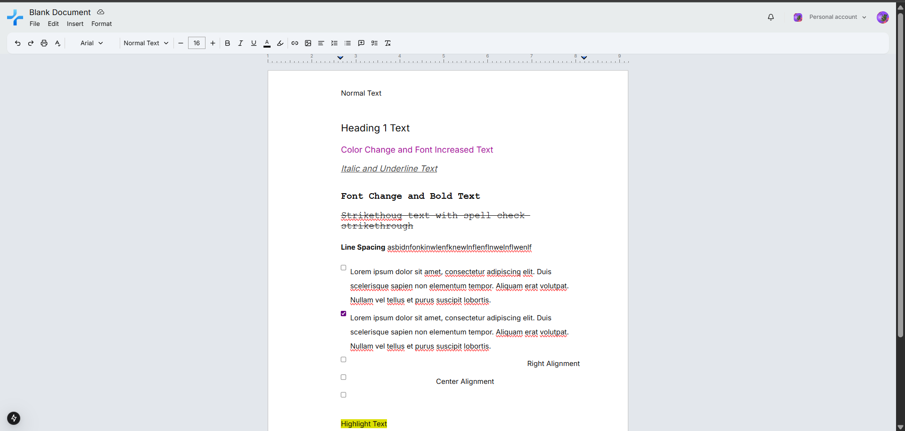
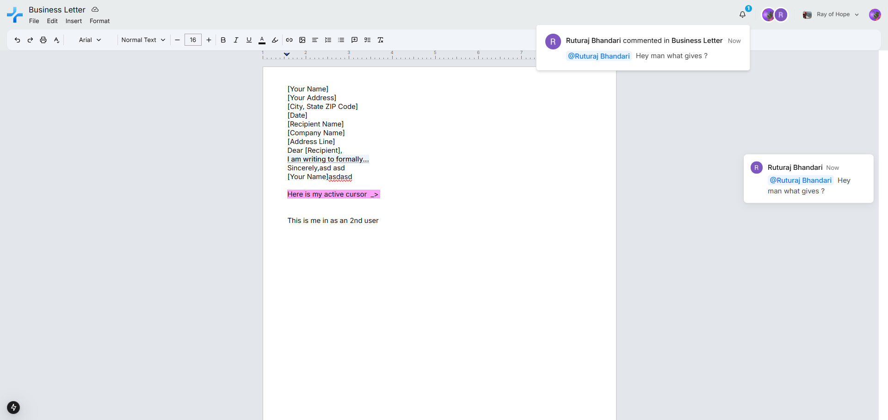

```markdown
# Google Docs Clone

A full-featured Google Docs clone with real-time collaboration, rich text editing, document templates, comments, notifications, user management, and organization workspaces.

**Live Demo**: [View Project on Vercel]
https://google-docs-clone-j388b65fq-ruturaj2003s-projects.vercel.app/

---

## 🖼️ Screenshots

### Home Page


### Editor Interface



### Real-time Collaboration



---

## ✨ Features

- 📝 Rich Text Editor (TipTap)
- 🤝 Real-time Collaboration (Liveblocks)
- 💬 Comments & Mentions
- 🔔 Notifications System
- 📑 Document Templates
- 📋 Copy & Paste Formatting
- ↩️ Undo / Redo History
- 📊 Table Support
- 🖼️ Image Uploads
- 📏 Margin Controls
- ⬇️ Export (PDF, HTML, TXT, JSON)
- 👤 User Profiles
- 🏢 Organization Workspaces & Invites
- 🔒 Authentication (Clerk)
- 🎯 Cursor Tracking
- 🎨 Text Formatting Tools
- 📝 Lists and Checklists
- 🔗 Link Embedding
- 📱 Responsive Design

---

## 🧰 Tech Stack

- **Framework**: Next.js 15
- **UI**: Tailwind CSS + Shadcn/UI
- **Database**: Convex
- **Auth**: Clerk
- **Collaboration**: Liveblocks
- **Deployment**: Vercel

---

## 🚀 Getting Started

### 1. Clone the Repository
```

### 2. Install Dependencies

(I recommend to use --legacy-peer-deps)

```bash
npm install
```

### 3. Configure Environment Variables

Create a `.env.local` file:

```bash
cp .env.example .env.local
```

Fill in the required environment variables.
check the dummy env file to see which all

### 4. Run the App

```bash
npm run dev
```

---

## 📁 Project Structure

```bash
/
├── app/                 # Next.js app directory
├── components/          # UI components
├── editor/              # TipTap setup and tools
├── lib/                 # Utility functions
├── convex/              # Backend logic (Convex)
├── public/              # Static assets
└── styles/              # Global styling
```

---

## 🛠️ Build & Deploy

To build the project:

```bash
npm run build
```

To deploy with Convex and Vercel:

```bash
npx convex deploy --cmd 'npm run build'
```

---

## 📄 License

MIT

---

## 🙋‍♂️ Author

Maintained by [Ruturaj].
Feel free to reach out or contribute.
https://ibb.co/WvhKrVcm
https://ibb.co/MyBGXG42
https://ibb.co/wNdrRN01
